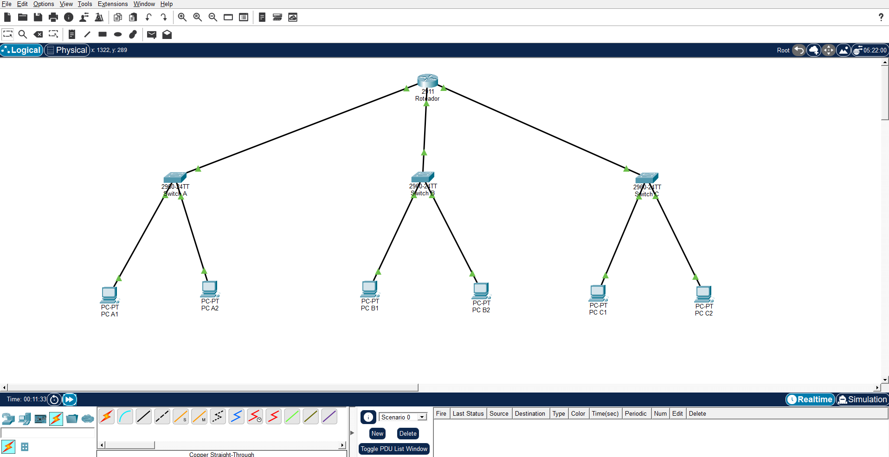
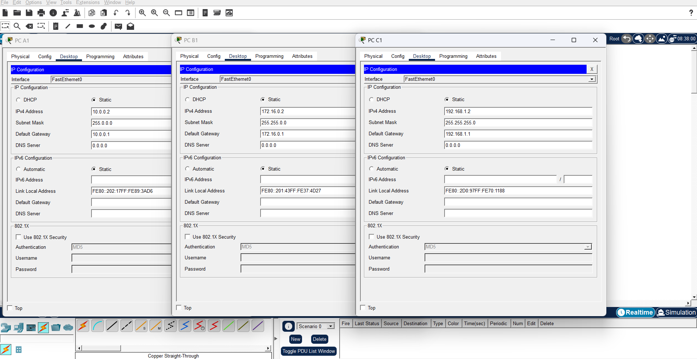
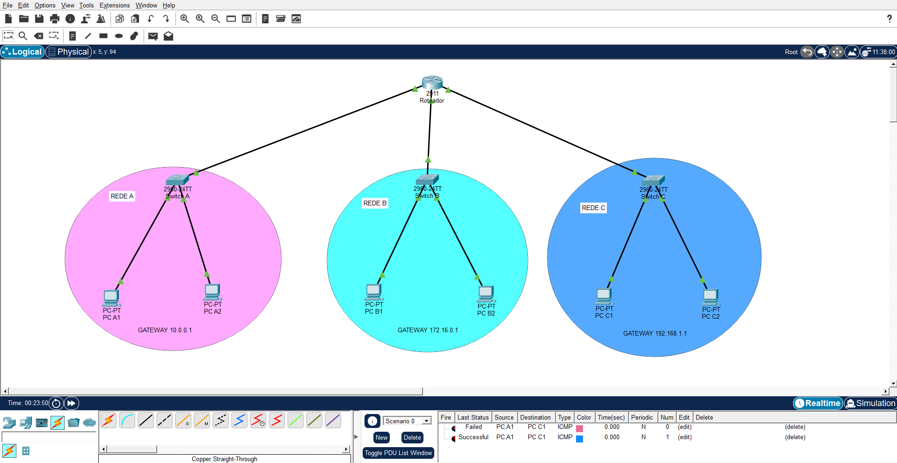

# Comunicação entre 3 Redes Distintas no Cisco Packet Tracer

## Contexto

Atividade em grupo do programa Mulher Digital (Cisco Networking Academy), parte do checkpoint 01 do módulo de Conceitos Básicos de Redes. A proposta era colocar em prática os conceitos de endereçamento IP e roteamento estudados até então, simulando um cenário com múltiplas redes que precisam se comunicar entre si.

## Objetivo

Configurar, no Cisco Packet Tracer, a comunicação entre três redes distintas (classes A, B e C) interligadas por um roteador central, entendendo na prática por que o roteamento é necessário quando redes têm faixas de IP diferentes.

## Ferramentas utilizadas

- Cisco Packet Tracer
- Roteador Cisco 2911
- Switches Cisco 2960 (3 unidades)
- Cabo Copper Straight-Through

## O que eu fiz

Foram montadas três redes, cada uma com um switch conectado a dois PCs, todas ligadas a um roteador central por interfaces Gigabit Ethernet distintas:

- Rede Classe A: switch A com os PCs A1 e A2
- Rede Classe B: switch B com os PCs B1 e B2
- Rede Classe C: switch C com os PCs C1 e C2

Cada rede recebeu uma faixa de IP correspondente à sua classe, com o gateway apontando para a interface do roteador daquela rede:

| Rede | Faixa de IP | Máscara | Gateway |
|---|---|---|---|
| Classe A | 10.0.0.2 – 10.0.0.3 | 255.0.0.0 | 10.0.0.1 |
| Classe B | 172.16.0.2 – 172.16.0.3 | 255.255.0.0 | 172.16.0.1 |
| Classe C | 192.168.1.2 – 192.168.1.3 | 255.255.255.0 | 192.168.1.1 |

O roteador foi configurado com uma interface em cada uma dessas três faixas, atuando como ponto central de roteamento entre elas.

## Resultado

Foi enviado um pacote ICMP do PC A1 (rede classe A) para o PC C1 (rede classe C) para validar a comunicação entre redes diferentes.

Na primeira tentativa o teste aparece como "Failed", o que é esperado em ambiente simulado, já que o Packet Tracer leva um tempo para popular as tabelas ARP e de roteamento antes da primeira comunicação. Nas tentativas seguintes o teste retornou "Successful", confirmando que a comunicação entre redes distintas funciona corretamente.

## O que aprendi

Essa atividade deixou mais claro na prática por que endereçamento IP e roteamento não são só teoria: até então tínhamos estudado classes de IP e o papel do gateway de forma mais conceitual, e montar essa topologia mostrou concretamente que sem o roteador configurado corretamente em cada uma das três faixas, os PCs simplesmente não conseguiriam se enxergar entre redes diferentes, mesmo estando todos conectados fisicamente.

Também ficou evidente a diferença entre o papel do switch e do roteador: o switch resolve a comunicação dentro da mesma rede, mas só o roteador consegue interligar redes com faixas de IP distintas. E o teste de conectividade reforçou algo importante sobre trabalhar com simulação: um resultado "Failed" na primeira tentativa não significa erro de configuração, é só o tempo que o ambiente simulado leva pra popular as tabelas de roteamento, então interpretar esse tipo de resultado com calma, antes de sair mexendo em tudo, também faz parte do aprendizado técnico.

## Competências demonstradas

- Configuração de endereçamento IP por classe (A, B e C), máscara de sub-rede e gateway
- Configuração básica de roteador Cisco (interfaces Gigabit Ethernet)
- Conexão e cabeamento de dispositivos de rede (Copper Straight-Through)
- Diagnóstico de conectividade entre redes usando teste ICMP (ping)
- Documentação técnica de um processo de configuração de rede

## Apresentação em vídeo

A apresentação completa dessa atividade, com a explicação de cada etapa pelo grupo, está disponível em vídeo: [assista aqui](https://www.youtube.com/watch?v=La3blO1GJZE)
